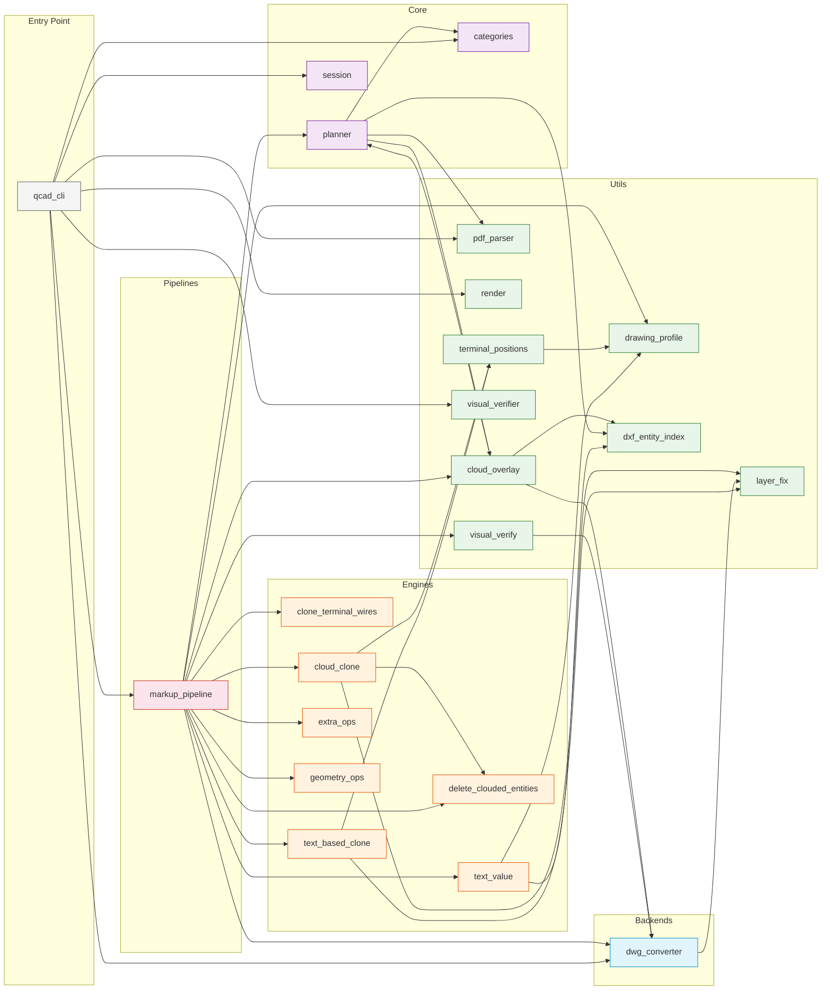

# cli-anything-qcad — Module Dependency Graph

**Note:** `archive/` at the repo root contains superseded prototypes — the old `vlm_automation/` directory (149 files), 5 retired engine variants, 3 unused backends, and orphaned scripts. None are imported by the active package.